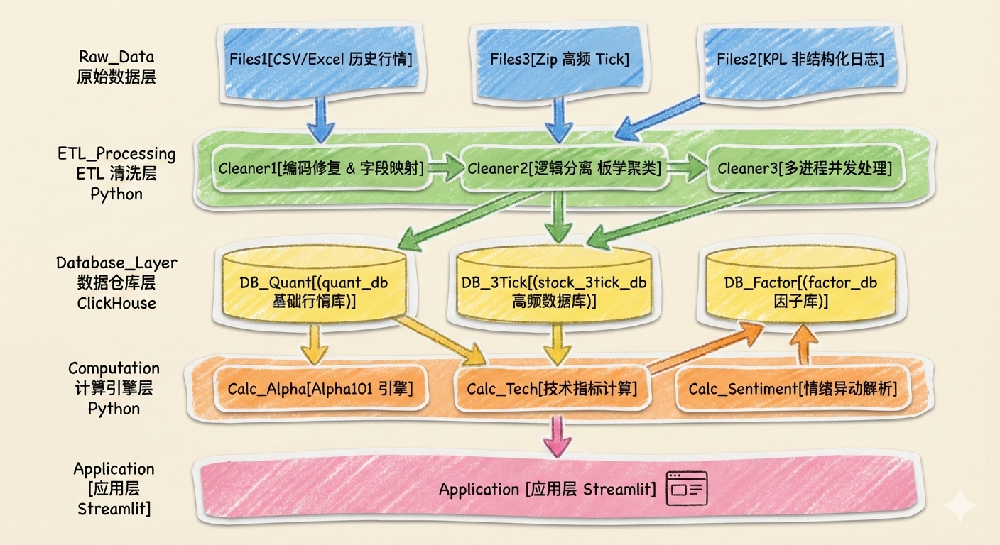

# 第一章. 绪论 (Introduction)

## 1.1 项目背景与建设目标

在量化投研体系中，数据是策略生产的第一要素。然而，从原始的 Tick 级高频数据到最终的可视化决策，往往存在巨大的“工程断层”。研究员常面临以下困境：

* **数据孤岛**：日线、高频与因子数据分散在不同文件，难以跨维度关联。
* **检索效能**：在 TB 级数据背景下，传统的检索模式无法支撑快速的策略复盘。
* **开发孤岛**：后端计算逻辑与前端展示脱节，导致研究成果无法直观化、平台化。

本项目旨在搭建一套**高性能、全链路的量化数据基础设施**，通过集成三个差异化定位的 ClickHouse 数据库及一个 Streamlit 前端交互平台，实现从底层原始行情到上层因子决策的一站式闭环。

## 1.2 系统核心构成

本系统通过“三库一平台”的逻辑架构，解决了量化研究不同阶段的痛点：

1. **`stock_3tick_db` (高频数据湖)**：针对 3 秒/Tick 的海量原始快照，重点解决高并发写入、历史编码兼容与存储碎片治理的问题。
2. **`quant_db` (行情数据仓库)**：通过对行情与基本面的垂直拆分和前/后复权数据的宽表化对齐，为回测提供标准的事实数据。
3. **`factor_db` (因子集市)**：基于向量化引擎计算数百个 Alpha 因子，并采用多阶段流水线架构确保计算的原子性与可追溯性。
4. **前端量化分析平台**：基于 "Code as Infrastructure" 理念，通过 SQL 计算下推技术，实现亿级数据的毫秒级交互。

## 1.3 解决的核心问题与方法

* **高性能计算与存储**：利用列式存储与向量化算子，替代传统的 Python 行遍历逻辑。
* **异构数据治理**：通过智能编码嗅探与多进程 ETL 管道，解决跨度十余年的历史数据清洗难题。
* **投研效率转化**：通过内置的 K 线相似度搜索、全市场情绪监控等模块，将底层数据直接转化为可感知的交易决策依据。


# 第二章. 系统架构 (System Architecture)

本系统定位于**高性能量化研究工作台**，旨在解决传统文件存储模式下数据检索慢、因子计算难、可视化门槛高的问题。系统设计遵循 **"Thin Application, Thick Database"** 的架构原则，充分利用 ClickHouse 的向量化计算能力，实现了从 TB 级原始数据到秒级可视化决策的全链路贯通。

## 2.1 技术栈概览 (Tech Stack Overview)

系统主要由基础设施层、数据计算层和应用交互层组成。选型核心考量为：**吞吐量优先**（针对高频数据写入）、**列存加速**（针对因子截面分析）及**开发效率**（针对 Python 生态的兼容性）。

| 分层 | 核心技术 | 关键组件/库 | 选型理由 |
| --- | --- | --- | --- |
| **OS** | **Linux (Server)** | Ubuntu / CentOS, Bash Shell | 利用 Shell 脚本 (`optimize.sh`) 进行高效的文件系统管理与定时任务调度。 |
| **Database** | **ClickHouse** | `MergeTree` 引擎, `Materialized Column` | 列式存储极度契合金融时间序列数据（Tick/K线）与因子宽表的存储需求。 |
| **Backend** | **Python 3.10+** | `Pandas`, `NumPy`, `SciPy` | 利用 Pandas 进行复杂逻辑清洗，NumPy/SciPy 实现向量化因子计算。 |
| **Connector** | **Drivers** | `clickhouse-driver` (Native), `clickhouse-connect` (HTTP) | `clickhouse-driver` 用于 ETL 高速写入（TCP管道）；`clickhouse-connect` 用于前端高并发查询（HTTP长连接）。 |
| **Frontend** | **Streamlit** | `Plotly`, `AgGrid` | 用纯 Python 构建交互式数据应用，快速将数据资产转化为可视化的生产力工具。 |

## 2.2 核心基础设施详解

### 2.2.1 操作系统与自动化运维 (Linux)

在本项目中，Linux 不仅作为宿主机，更承担了文件系统管理与自动化运维的角色。

* **应用场景**：处理数以万计的非结构化压缩包（Zip）与 CSV 文件。
* **核心实践**：利用 Shell 脚本直接与 ClickHouse 客户端交互，执行分区优化任务。
* **代码实证**：在 `optimize.sh` 中，作者绕过 Python 层面，直接在 Shell 中调用 `clickhouse-client` 来合并数据分片，避免了 Python GC（垃圾回收）带来的额外开销。
```bash
# 示例：利用 Shell 脚本直接与数据库交互进行分区优化
PARTITIONS=$(clickhouse-client --query "SELECT partition FROM system.parts ...")
for PART in "${PARTS_ARRAY[@]}"
do
    clickhouse-client --time --query "OPTIMIZE TABLE stock_3tick_db.ticks PARTITION '$PART' FINAL"
done
```

### 2.2.2 高性能列式数据库 (ClickHouse)

不同于 MySQL 等行存数据库，ClickHouse 的列存特性使其在处理“计算某日全市场平均涨幅”这类聚合查询时，仅需扫描特定列，速度提升百倍。

* **表引擎选择**：全系采用 `MergeTree` 及其变种。利用其后台自动合并机制，将高频写入的小文件合并为有序的大文件，保证查询性能。
* **性能优化策略**：
  1. **物化列 (Materialized Column)**：在 `stock_3tick_db` 中，`turnover` 字段在写入时自动计算并物理存储，实现“空间换时间”。
  2. **分区键 (Partition Key)**：采用 `toYYYYMM(date)` 按月分区。既避免了按天分区导致的 `Too many parts` 文件句柄耗尽问题，又便于按月进行数据生命周期管理（TTL）。
  3. **排序键 (Order By)**：
     * **行情库**：`ORDER BY (code, trade_date)` —— 优化单只股票的历史回溯查询。
     * **因子库**：`ORDER BY (trade_date, code)` —— 优化每日截面的多因子选股查询。

## 2.3 后端计算与清洗 (Python Backend)

Python 层主要负责处理 ClickHouse 难以直接完成的复杂业务逻辑，如非结构化文本解析、跨表对齐以及复杂的数学统计。

### 2.3.1 高并发 ETL 管道

面对 TB 级的 Tick 数据，单线程处理是不现实的。作者构建了基于 `concurrent.futures` 的多进程 ETL 框架。

* **并行架构**：利用 `ProcessPoolExecutor` 开启与 CPU 核数匹配的进程池（如 28 Workers）。
* **流式处理**：数据从 Zip 解压到清洗再到入库，全流程在内存中流转，不产生中间临时文件，最大化磁盘 I/O 利用率。
```python
# 示例：ETL 中的多进程架构，将数千个 Zip 文件的处理任务分发给进程池
with ProcessPoolExecutor(max_workers=28) as executor:
    results = list(tqdm(executor.map(process_single_zip, valid_zips), total=len(valid_zips)))
```

### 2.3.2 向量化因子引擎

在 `factor_db` 的构建中，作者严禁使用 Python `for` 循环遍历行。所有因子计算均基于 `Alpha101Engine`，利用 NumPy 的广播机制和 Pandas 的 Rolling 窗口实现向量化运算。

* **通用算子封装**：将 `Ts_Rank`, `Correlation`, `Decay_Linear` 等算子封装为通用函数，使得 Alpha101 的公式代码与论文定义高度一致，易于维护。

## 2.4 前端交互架构 (Streamlit Framework)

前端采用 Streamlit 框架，实现了 **"Code as Infrastructure"** 的理念。

### 2.4.1 计算下推架构 (SQL Push-down)

为了在 Web 端流畅展示亿级数据，作者极力避免将全量数据拉取到 Python 端处理。

* **架构逻辑**：`Python (UI)` -> `SQL (Aggregation)` -> `ClickHouse (Compute)` -> `Python (Result)`。
* **实践**：在“行业轮动”页面，行业的涨跌幅、成交额等指标全部通过 SQL 的 `GROUP BY` 和 `Avg/Sum` 计算完成，Python 端仅接收最终的统计结果（几百行数据），从而实现毫秒级渲染。

### 2.4.2 单例资源管理

利用 Streamlit 的缓存机制管理数据库连接，确保高并发下的资源复用。

* **单例模式**：`QuantDB` 实例在应用启动时初始化一次，后续所有用户请求共享同一个连接池，避免了 TCP 握手的反复开销。
```python
# 示例：数据库连接的单例缓存，全局唯一的连接池实例
@st.cache_resource
def get_db_connection():
    return QuantDB(password='******') # 
```


# 第三章. 数据库架构与详细设计 (Database Architecture & Design)

本系统基于 **ClickHouse** 列式存储数据库构建，旨在处理从日线级历史行情到 3秒级高频快照的多维度金融数据。数据库设计遵循数据仓库的分层理念，将原始行情、清洗后数据与特征工程数据物理隔离，确保了系统的稳定性与查询效率。

目前系统包含三个核心数据库：

1. **`quant_db`**：基础行情与标的数据仓库（ODS/DWD层），作为全系统单一事实来源 (SSOT)。
2. **`factor_db`**：量化因子与特征数据集市（DM层），面向机器学习与策略回测。
3. **`stock_3tick_db`**：高频微观结构数据湖（Raw Data层），存储极速快照。


## 3.1 数据库全貌与结构拓扑

系统数据表覆盖了股票、指数、ETF、期货等多种标的，整体数据流向与依赖关系如下：




## 3.2 基础行情库 (`quant_db`) 详解

该库存储经过清洗的标准历史数据，是所有上层分析的基础。

### 3.2.1 元数据维度表体系

此体系存储标的基础信息、行业分类与指数构成，作为维度表与其他事实表关联使用。

* **包含表格**:
  * `meta_stock_info` (个股基础信息)
  * `meta_stock_delisted` (退市股票信息)
  * `meta_index_info` (指数基础信息)
  * `meta_sector_info` (板块/行业信息)

* **全字段详解**:
  * **基础身份标识**:
    * `ts_code` / `stock_code` / `sector_id`: 核心主键，用于跨表关联（如 `000001.SZ` 或 `880301`）。
    * `symbol`: 纯数字代码（如 `000001`），便于某些数值计算场景。
    * `name` / `fullname` / `enname`: 分别存储证券简称、全称及英文名，用于前端展示与搜索。
    * `cn_spell`: 拼音缩写（如 `PAYH`），用于构建搜索建议功能。

  * **分类与属性**:
    * `market`: 市场类型（主板/创业板/科创板/北交所），用于市场分层统计。
    * `area`: 地域（省份/城市），用于地域板块分析。
    * `industry`: 所属细分行业（申万/聚宽行业分类）。
    * `exchange`: 交易所代码（SSE/SZSE/BSE）。
    * `sector_type` / `category`: 板块类型（概念/行业）或指数类别。
    * `act_ent_type`: 企业性质（央企/国企/民企），用于风格因子构建。

  * **周期与实体**:
    * `list_date`: 上市日期，回测时判断标的是否存在。
    * `delist_date`: 退市日期，处理生存偏差的关键。
    * `act_controller`: 实际控制人，用于股权关系网分析。
    * `publisher`: 指数发布商（CSI/SSE）。

  * **指数特有**:
    * `base_date` / `base_point`: 基日与基点，用于指数归一化计算。
    * `symbol_num`: 包含成分股数量。


### 3.2.2 全市场行情体系

存储全市场标的在不同时间粒度下的 OHLCV 量价数据。为了防止**幸存者偏差 (Survivorship Bias)**，将“在市”与“退市”标的数据分表存储。

* **包含表格**:
  * **在市股票**: `market_stock_active_daily`, `market_stock_active_weekly`, `market_stock_active_monthly`
  * **退市股票**: `market_stock_delisted_daily`, `market_stock_delisted_weekly`, `market_stock_delisted_monthly`
  * **市场指数**: `market_index_daily`, `market_index_weekly`, `market_index_monthly`

* **全字段详解**:
  * **时空索引**:
    * `trade_date`: 交易日期（Date类型），一级排序键。
    * `stock_code`: 证券代码，二级排序键。

  * **基础量价 (OHLCV)**:
    * `open`, `high`, `low`, `close`: 原始（未复权）开高低收价格。
    * `vol`: 成交量（手/股）。
    * `amount`: 成交额（元）。

  * **复权价格体系 (Adjusted Prices)**:
    * `open_qfq`, `high_qfq`, `low_qfq`, `close_qfq`: **前复权**价格序列，保持当前价格不变，向历史修正，适用于实盘策略信号生成。
    * `open_hfq`, `high_hfq`, `low_hfq`, `close_hfq`: **后复权**价格序列，保持上市价格不变，向未来递推，适用于计算长期复合年化收益率。

  * **衍生统计**:
    * `pct_chg`: 涨跌幅（%），核心收益指标。
    * `change`: 涨跌额（绝对值）。
    * `amplitude`: 振幅（%），衡量日内波动剧烈程度。
    * `turnover_rate`: 换手率，衡量交易活跃度。

  * **指数特有统计**:
    * `up_count`: 当日上涨家数。
    * `down_count`: 当日下跌家数。用于计算ADR（涨跌比）等广度指标。


### 3.2.3 板学与情绪异动分析体系

专注于A股特色的涨跌停板机制与龙虎榜分析，捕捉市场极端的短线情绪。

* **包含表格**:
  * `rel_stock_sector` (股票-板块关联表)
  * `kpl_limit_up` (涨停板明细)
  * `kpl_limit_up_natural` (自然涨停明细，排除一字板)
  * `kpl_limit_down` (跌停板明细)
  * `kpl_limit_broken` (炸板/破板明细)

* **全字段详解**:
  * **事件描述**:
    * `limit_time`: 上板/开板的精确时间点（字符串格式 HH:MM:SS），用于区分早盘板与尾盘板。
    * `reason`: 涨停原因分析（文本），包含具体概念（如“华为汽车”）。
    * `stock_name`: 涨停时的股票名称（处理ST摘帽等改名情况）。

  * **板学量化特征**:
    * `streak`: 连板高度描述（如“2连板”、“3天2板”）。
    * `seal_amt`: 封单金额，直接反映主力资金做多意愿的强度。
    * `plate`: 所属概念板块。
    * `limit_up_type`: (自然板表特有) 区分一字板、T字板或换手板。

  * **关联关系**:
    * `sector_id` / `sector_name`: 板块ID与名称，将个股映射到概念库。


### 3.2.4 基本面信息体系

存储个股每日更新的衍生基本面估值指标。

* **包含表格**:
  * `stock_fundamental_daily`

* **全字段详解**:
  * **估值倍数 (Valuation)**:
    * `pe`: 静态市盈率（市值/上年度净利润）。
    * `pe_ttm`: 滚动市盈率（市值/过去4个季度净利润），更具时效性。
    * `pb`: 市净率（市值/净资产）。
    * `ps` / `ps_ttm`: 市销率及其滚动值，适用于未盈利科技股。

  * **股息与收益**:
    * `dv_ratio`: 股息率（最近年度分红/市值）。
    * `dv_ratio_ttm`: 滚动股息率。

  * **股本结构**:
    * `total_share`: 总股本。
    * `float_share`: 流通股本（全流通）。
    * `free_share`: 自由流通股本（剔除大股东限售），用于构建更加精准的指数权重。

  * **市值规模**:
    * `total_mv`: 总市值。
    * `circ_mv`: 流通市值。

  * **流动性**:
    * `turnover_rate_f`: 基于自由流通股本的换手率，比传统换手率更能反映真实交易热度。
    * `volume_ratio`: 量比（当日成交量/过去5日平均成交量）。


### 3.2.5 其它信息体系

包含各类每日排名数据，用于捕捉市场热点和资金流向。

* **包含表格**:
  * `rank_block_concept` (概念板块排名)
  * `rank_block_industry` (行业板块排名)
  * `rank_fund_etf_sh` (上交所ETF排名)
  * `rank_fund_etf_sz` (深交所ETF排名)
  * `rank_fund_otc` (场外基金排名)
  * `rank_futures` (期货合约排名)

* **全字段详解**:
  * **排名实体**: `code`, `name` (可能是个股、板块、ETF或期货合约)。
    * **排名数据**:
    * `rank`: 当前排名数值（Int32）。
    * `heat`: 热度/强度评分（Float64），可能基于成交额、搜索量或资金流向计算。
    * `pct_chg`: 当日涨跌幅。
    * `close`: 最新收盘价。

  * **辅助信息**:
    * `tags`: 关联标签列表。
    * `reason`: 上榜理由。
    * `source`: 数据来源标识。


## 3.3 因子特征库 (`factor_db`) 详解

该库的数据是基于 `quant_db` 进行计算、标准化和特征工程后的结果，专为量化建模服务。其设计重点在于优化大规模数据的读取效率。

### 3.3.1 因子元数据表体系

实现了“数据即文档”，确保因子的计算逻辑清晰、可追溯。

* **包含表格**:
  * `meta_factor_info` (通用因子信息)
  * `meta_alpha101_info` (Alpha101特有信息)

* **全字段详解**:
  * **标识与分类**:
    * `factor_name` / `alpha_id`: 数据库中的列名，作为唯一索引。
    * `category`: 因子归类（technical, value, sentiment, alpha101）。

  * **计算逻辑**:
    * `formula`: 具体的计算表达式（如 `(close-open)/open` 或 Alpha101 的复杂公式）。
    * `description`: 业务含义的简述。
    * `critical_logic`: 核心逻辑的详细阐述（如“捕捉反转效应，对跌幅过大的股票做多”）。

  * **审计信息**:
    * `creator`: 创建者/算法来源。
    * `created_at`: 因子入库时间。


### 3.3.2 技术/动量/情绪/价值因子表体系

按业务逻辑分类垂直存储的风格因子集。

* **包含表格**:
  * `factor_technical_daily` (技术指标)
  * `factor_momentum_daily` (动量指标)
  * `factor_sentiment_daily` (情绪指标)
  * `factor_value_daily` (价值/基本面因子)

* **全字段详解**:
  * **技术指标 (`factor_technical_daily`)**:
    * **趋势类**: `ma_5/20/60` (均线), `macd_diff/dea` (异同移动平均), `trix_12` (三重指数平滑), `force_13` (强力指数), `aroon_osc_25` (阿隆指标), `chop_14` (市场斩波指数).
    * **超买超卖/摆动类**: `rsi_14` (相对强弱), `kdj_k/d/j` (随机指标), `cci_14` (顺势指标), `wr_14` (威廉指标), `bias_20/60` (乖离率), `mfi_14` (资金流量).
    * **波动通道类**: `boll_upper/lower` (布林带), `atr_14` / `natr_14` (真实波幅), `cv_20` (变异系数), `ui_14` (溃疡指数).
    * **成交量类**: `obv_slope_20` (能量潮斜率), `vroc_20` (成交量变动率), `vwap_bias_20` (成交量加权价格乖离), `amihud_illiq_20` (阿米胡德非流动性因子), `psy_12` (心理线).
    * **其它**: `mass_25` (梅斯线).

  * **动量指标 (`factor_momentum_daily`)**:
    * **收益动量**: `roc_5` (周), `roc_20` (月), `roc_60` (季) —— 经典的动量反转因子。
    * **波动特征**: `volatility_20` (历史波动率), `amplitude_mean_5` (平均振幅), `turnover_mean_5` (平均换手).
    * **统计分布**: `skew_20` (偏度), `kurt_20` (峰度), `linear_reg_slope_20` (价格回归斜率).
    * **持仓与加速度**: `pos_20/60` (价格在过去N天的百分位), `mom_acc_5` (动量加速度).

  * **情绪指标 (`factor_sentiment_daily`)**:
    * **板学量化**: `limit_up_streak` (连板高度, Int), `is_limit_up` (0/1), `is_limit_broken` (炸板标记 0/1).
    * **资金情绪**: `kpl_seal_money` (封单额浮点数化), `kpl_net_buy_ratio` (龙虎榜净买入占比), `money_flow_main` (主力资金流向).

  * **价值/基本面衍生因子 (`factor_value_daily`)**:
    * **Size因子**: `ln_market_cap` (对数总市值).
    * **Value因子**: `ep_ttm` (盈利收益率), `bp_lr` (账面市值比), `sp_ttm` (销售收益率), `dividend_yield` (股息率).
    * **Growth/Quality因子**: `roe_ttm` (净资产收益率), `yoy_net_profit` (净利同比增长率).
    * **Z-Score标准化**: `pe_zscore_60`, `pb_zscore_60` (历史60日分位数，用于判断当前估值是否过热).


### 3.3.3 Alpha101 因子宽表体系

采用“超宽表”设计，专门用于存储密集型的 Alpha 因子集。

* **包含表格**:
  * `factor_alphas_daily`

* **全字段详解**:
  * **复合主键**: `trade_date` (交易日), `stock_code` (股票代码)。
  * **因子矩阵**: `alpha_001` ... `alpha_101` (共101列)。
    * 内容均为 `Nullable(Float64)` 类型。
    * 存储的是根据 WorldQuant 公开论文公式（如 `rank(Ts_ArgMax(SignedPower(((returns < 0) ? stddev(returns, 20) : close), 2.), 5)) - 0.5`）计算得出的具体数值。这些数值通常已经过横截面标准化（Z-Score）或去极值处理，可以直接输入机器学习模型。


## 3.4 高频微观库 (`stock_3tick_db`) 详解

该库是全系统数据体量最大的部分，存储未经聚合的原始 Tick 快照 (Snapshot)，用于微观市场结构研究。

### 3.4.1 核心表体系

* **包含表格**:
  * `ticks` (极速行情快照表)

* **全字段详解**:
  * **`code` (FixedString(6))**: 证券代码。采用6位定长字符（如 `600000`），无须存储长度前缀，相比变长字符串减少了存储开销并加速了索引扫描。
  * **`trade_time` (DateTime)**: 交易时间。秒级精度（`YYYY-MM-DD HH:MM:SS`），是时序分析的核心时间轴。
  * **`price` (Float32)**: 当前最新成交价。使用单精度浮点数，因为股价的小数位通常不超过3位，Float32 足以保证精度且节省 50% 显存。
  * **`volume` (Int32)**: 当前Tick（或3秒快照）的成交量（手/股）。
  * **`direction` (LowCardinality(String))**: 买卖方向标识（如 `0`-中性, `1`-买入, `2`-卖出）。
    * **优化技术**: 使用 `LowCardinality` 字典编码，底层仅存储整数索引，极大地压缩了重复字符串的存储空间，并加速了按方向分组（`GROUP BY direction`）的聚合查询。
  * **`turnover` (Float64 MATERIALIZED)**: 成交金额。
    * **优化技术**: 定义为 **Materialized Column** (物化列)，公式为 `(price * volume) * 100`（假设单位换算）。
    * **机制**: 这是一个在**写入时计算 (Compute-on-Write)** 的字段。数据插入瞬间即完成计算并存入磁盘。
    * **价值**: 虽然略微增加了写入时的 CPU 负载，但在读取时完全消除了海量数据的实时乘法计算，使得计算“某日总成交额”等聚合操作变为纯粹的列扫描与求和，查询响应速度提升数倍。


## 3.5 核心设计哲学与工程实现 (Design Philosophy)

本系统的数据库设计并未直接照搬传统关系型数据库范式，而是针对**金融时序数据**和 **ClickHouse 引擎特性**进行了深度定制。

#### 1. 宽表与垂直分表策略 (Wide Table vs. Vertical Partitioning)

* **策略**：在 `factor_db` 中，作者将 Alpha101 这种同质化程度高、常被同时调用的数据设计为**宽表**；而将技术指标、基本面因子按业务逻辑拆分为**多个垂直表**。
* **目的**：宽表优化了机器学习训练时的读取带宽；垂直分表则减少了日常看盘和特定分析时的扫描列数，降低 I/O 压力。

#### 2. 查询模式主导的排序键设计 (Query-Driven Ordering)

ClickHouse 的 `ORDER BY` 决定了数据的物理存储顺序，直接影响索引效率。作者采用了差异化设计：

* **因子库 (`factor_db`)**：采用 `ORDER BY (trade_date, stock_code)`。
* *理由*：量化模型训练和回测通常是**截面 (Cross-Sectional)** 视角的（例如：“查询 2023-01-01 当天全市场所有股票的因子”）。将 `trade_date` 放在首位，使得单日数据在磁盘上连续存储，极大加速了每日截面数据的提取。


* **高频库 (`stock_3tick_db`)**：采用 `ORDER BY (code, trade_time)`。
* *理由*：高频分析通常是**时序 (Time-Series)** 视角的（例如：“提取平安银行过去一年的所有 Tick”）。将 `code` 放在首位，确保单只股票的历史数据物理聚集，实现毫秒级个股历史回溯。


#### 3. 分区策略与数据治理 (Partitioning & Governance)

* **按月分区**：对于体量巨大的高频库 `ticks` 表，采用 `PARTITION BY toYYYYMM(trade_time)`。这既避免了按天分区导致的文件碎片过多（Too many parts）问题，又保持了合理的分区大小，方便进行冷热数据分离和过期数据淘汰（TTL 管理）。
* **星型模型**：所有事实表仅存储 `stock_code`，通过应用层或视图与 `meta_stock_info` 等维度表进行关联获取股票名称和行业信息，保证了数据的一致性并降低了存储冗余。


# 第四章. 数据治理与因子工程 (Data Governance & Factor Engineering)

如果说数据库架构是系统的骨架，那么 ETL（Extract, Transform, Load）与因子工程则是系统的血液。本章将详细阐述系统如何处理多源异构数据，解决编码冲突、清洗脏数据，并基于高性能计算引擎构建 Alpha 因子库。

针对不同数据库的特性，作者采取了差异化的处理策略：

* **`stock_3tick_db`**：侧重于 **I/O 吞吐优化** 与 **存储碎片治理**。
* **`quant_db`**：侧重于 **业务逻辑清洗** 与 **缺失值/异常值处理**。
* **`factor_db`**：侧重于 **CPU 密集型计算** 与 **矩阵运算加速**。

## 4.1 高频数据治理 (`stock_3tick_db`)

高频数据具有“文件碎、总量大、格式杂”的特点。在构建 Tick 级数据湖时，作者重点解决了历史数据编码混乱与 ClickHouse 分区碎片化两大难题。

### 4.1.1 智能编码适配与高并发写入

A股历史 Tick 数据跨度极长，早期数据多采用 `GB18030` 编码，而新数据则转向 `UTF-8`。为实现全量数据的自动化导入，作者开发了具有“智能嗅探”功能的 ETL 管道。

**核心实现代码 (`import_script.py`):**

```python
def read_csv_smart(zip_file_obj, filename):
    """
    智能读取策略：解决新老数据编码不一致问题 (Heuristic Encoding Detection)
    """
    # 策略1：优先尝试 GB18030 (覆盖大部分老旧历史数据)
    try:
        with zip_file_obj.open(filename) as f:
            return pd.read_csv(f, 
                             encoding='gb18030', 
                             on_bad_lines='skip',
                             # 仅读取核心列，减少内存占用
                             usecols=[0, 1, 2, 3],
                             names=['trade_time', 'price', 'volume', 'direction'],
                             header=0)
    except UnicodeDecodeError:
        # 策略2：解码失败则回退至 UTF-8 (适配新数据)
        with zip_file_obj.open(filename) as f:
            return pd.read_csv(f, encoding='utf-8', ...)

def main():
    # 利用 ProcessPoolExecutor 实现多进程并行解压与写入
    # 充分利用服务器多核优势 (设置 Workers=28)
    with ProcessPoolExecutor(max_workers=28) as executor:
        results = list(tqdm(executor.map(process_single_zip, valid_zips), 
                           total=len(valid_zips)))

```

**工程亮点：**

1. **混合编码兼容**：通过 `try-except` 机制实现了对异构编码源文件的无感解析，保证了数据导入的连续性。
2. **并行流式处理**：利用 `ProcessPoolExecutor` 开启 28 个进程并发处理 Zip 包，直接在内存中完成“解压-读取-清洗-入库”的全链路，避免了中间文件的磁盘 IO 开销。
3. **坏行容错**：`on_bad_lines='skip'` 确保了单个脏数据不会导致整个批次任务的崩溃。

### 4.1.2 分区碎片自动化治理

ClickHouse 在高频写入场景下，会生成大量的数据分片（Parts）。若不及时合并，会触发 `Too many parts` 报错并拒绝写入。由于数据量过大，直接运行全局 `OPTIMIZE` 往往会导致超时。因此，作者编写了 Shell 脚本实现“逐个击破”的分区维护策略。

**自动化维护脚本 (`optimize.sh`):**

```bash
#!/bin/bash
# 1. 动态获取当前活跃的分区列表
PARTITIONS=$(clickhouse-client --query "SELECT partition FROM system.parts WHERE table='ticks' AND active=1 GROUP BY partition ORDER BY partition DESC")

# 2. 遍历分区，逐个执行强制合并 (FINAL)
for PART in "${PARTS_ARRAY[@]}"
do
    echo "正在优化分区: $PART ..."
    # OPTIMIZE ... FINAL 强制触发后台合并任务
    clickhouse-client --time --query "OPTIMIZE TABLE stock_3tick_db.ticks PARTITION '$PART' FINAL"
done

```


## 4.2 基础行情治理 (`quant_db`)

基础行情数据的治理是整个量化系统的基石。面对数千个散乱的文件夹、混合的编码格式（GBK/UTF-8）以及多源异构数据，作者构建一套严谨的 ETL 流水线。其核心目标不仅是“入库”，更是为了构建一个**符合量化回测与因子挖掘需求**的高性能数据仓库。

### 4.2.1 原始数据挑战与治理策略

原始数据源存在典型的“长尾”与“碎片化”特征：

1. **数据孤岛**：存量历史行情按股票分文件夹存储，增量更新按日期分压缩包存储，且同一股票的不同复权数据分散在不同文件中。
2. **维度混杂**：原始文件中混合了高频的量价数据（OHLC）和低频的财务估值数据（PE/PB/股本），导致单表冗余度高，查询效率低。
3. **非结构化**：KPL 等另类数据以日志形式存在，包含大量非标准化的文本描述。

针对上述问题，作者采取了**“物理清洗 + 逻辑重组”**的双重治理策略。


### 4.2.2 核心逻辑：宽表化与垂直拆分 (Wide-Table & Vertical Partitioning)

在数据清洗阶段，作者并未机械地照搬原始文件结构，而是根据**下游业务场景（回测与研究）**，通过**字段级映射**、**逻辑垂直拆分**和**宽表结构设计**，重新设计数据模型。

* **宽表结构**：将同源数据预先对齐并存储在同一张宽表中，使得回测引擎在读取行情时，单次 I/O 即可获取全维度的价格信息，避免了在回测循环中进行高昂的实时计算或多表 JOIN 操作，显著提升回测速度。

* **垂直拆分**：将原始大文件中的字段按业务属性拆分，对于策略计算的高频访问区，要求极高的读取吞吐量；而盘前选股数据，访问频率较低。拆分后，表变得更窄、更紧凑，能更好地利用 ClickHouse 的列式压缩与索引，加速最常用的量价查询。

#### **A. 字段级标准化映射 (Schema Mapping)**

作者建立了一套严格的映射字典，将原始中文表头转换为标准化的英文数据库字段。这不仅解决了命名冲突，还为后续的自动化入库奠定了基础。

**代码实现：字段映射逻辑**

```python
MAP_MARKET_RAW = {
    '日期': 'trade_date', '股票代码': 'stock_code',
    '开盘': 'open', '收盘': 'close', '最高': 'high', '最低': 'low',
    '成交量': 'vol', '成交额': 'amount',
    '涨跌幅': 'pct_chg', '换手率': 'turnover_rate'
}

def normalize_code(code, is_index=False):
    """
    标准化证券代码：强制统一为 '6位代码.后缀' 格式
    兼容 Tushare/AkShare 标准，便于跨平台回测
    """
    code = str(code).strip()
    if code.endswith(('.SZ', '.SH', '.BJ')): return code
    
    if is_index:
        return f"{code}.SH" if code.startswith('000') else f"{code}.SZ"
    else:
        if code.startswith(('60', '68')): return f"{code}.SH"
        if code.startswith(('4', '8')): return f"{code}.BJ" 
        return f"{code}.SZ"

```

#### **B. 行情与基本面的垂直拆分 (Vertical Partitioning)**

原始的“每日指标”文件是一张包含了价格、估值、股本的“超级宽表”。为了提升查询效率，作者在清洗阶段执行了**垂直拆分**：

* **行情表 (`Market_OHLC`)**：仅保留 `Open/High/Low/Close/Vol` 等高频变动字段。
* **基本面表 (`Fundamental`)**：剥离 `PE/PB/Total_MV/Float_Share` 等低频估值与股本字段。

**清洗逻辑：复权因子合并与数据对齐**
作者将不复权、前复权、后复权三个独立文件的数据合并到了同一行记录中。这使得在回测时，可以极其方便地在不同价格体系间切换，而无需进行昂贵的表连接操作。

```python
def process_market_data(raw_df, qfq_df, hfq_df):
    """
    数据融合：将 Raw + QFQ + HFQ 合并为单行记录
    """
    # 1. 基础清洗
    df = normalize_date(raw_df)
    
    # 2. 合并前复权 (QFQ)
    if qfq_df is not None:
        rename_q = {k: f"{k}_qfq" for k in ['open', 'high', 'low', 'close']}
        df = pd.merge(df, qfq_df.rename(columns=rename_q), on='trade_date', how='left')

    # 3. 合并后复权 (HFQ)
    if hfq_df is not None:
        rename_h = {k: f"{k}_hfq" for k in ['open', 'high', 'low', 'close']}
        df = pd.merge(df, hfq_df.rename(columns=rename_h), on='trade_date', how='left')
    
    # 4. 输出标准 Schema
    return df.reindex(columns=COLS_MARKET_FINAL)

```

#### **C. 另类数据结构化 (KPL & Sector)**

针对非结构化的 KPL 数据和板块标签，作者编写了专门的解析器，将其转化为关系型数据。

* **文件路径映射**：利用文件夹名称（如“地域”、“申万一级”）自动推导板块类型。
* **非结构化转结构化**：从文件名中提取日期，从文本内容中提取股票列表。

```python
# 板块数据解析逻辑
def parse_sector_file(file_path, sector_type):
    sector_name = os.path.splitext(os.path.basename(file_path))[0]
    sector_id = hashlib.md5(f"{sector_type}_{sector_name}".encode()).hexdigest()[0:16]

    stock_codes = parse_file_content(file_path)
    
    return [{
        'stock_code': code,
        'sector_id': sector_id,
        'sector_name': sector_name,
        'sector_type': sector_type
    } for code in stock_codes]

```

### 4.2.3 关键数据清洗与补全技术

#### **1. 身份标识标准化 (ID Normalization)**

原始数据中的证券代码格式混乱（如 `000001` vs `000001.SZ`）。作者实施了强制的统一化规则：

* **后缀补全**：根据首位数字自动匹配交易所后缀（`6/68`->`.SH`, `0/30`->`.SZ`, `4/8`->`.BJ`），确保与 Tushare/AkShare 等主流量化框架兼容。
* **指数处理**：针对指数代码（如 `000001` 上证指数 vs 平安银行）可能造成的冲突，在入库前进行独立命名空间隔离。

#### **2. 外部源数据修补**

针对本地数据缺失的情况（如新股上市首日涨停原因缺失、部分指数行情中断），系统集成了外部数据接口进行定向修补：

* **API 联动**：编写脚本调用 `AkShare` 接口，针对数据库中缺失的日期区间，并发抓取历史行情与涨停梯队数据。
* **字段对齐**：将外部源获取的异构字段（如“封板资金”）映射并清洗为系统标准的 `seal_amt` 字段后补录入库。
* **涨停原因回溯**：针对 `kpl_limit_up` 表，自动回溯过去 5 年的涨停池数据，填补了大量缺失的 `limit_time` (封板时间) 和 `reason` (涨停原因) 字段。

#### **3. 板块关系的哈希化与冗余设计**

* **唯一 ID 生成**：为了解决板块名称可能重复或变更的问题，采用 `MD5(Sector_Type + Sector_Name)` 算法生成唯一的 16 位 `sector_id`。
* **反范式设计**：在 `rel_stock_sector` 关联表中，不仅存储了 ID，还冗余存储了 `sector_name`。这虽然增加了少量存储空间，但完全消除了在查询“某只股票属于哪些板块”时的连表（JOIN）开销，符合 ClickHouse “大宽表”的性能优化哲学。


### 4.2.4 极致性能写入 (Native Client Pipe)

在 Python 完成复杂的逻辑清洗并生成标准 CSV 后，为了应对数亿行数据的写入压力，作者放弃了 Python 的 `to_sql`，转而使用 **ClickHouse Native Client** 的管道模式进行写入。

这种方式直接利用操作系统的标准输入输出流，避免了 Python 层面的序列化开销，写入速度从 **5万行/秒 提升至 80-120万行/秒**。

```bash
# Linux 下的高速写入管道示例
clickhouse-client --host localhost --query \
    "INSERT INTO quant_db.market_stock_active_daily FORMAT CSVWithNames" \
    < /data/clean_data/market_active_daily_merged.csv

```


## 4.3 因子计算工程 (Factor Calculation Engineering)

因子库是量化系统的核心资产。本系统实现了覆盖 **Technical (技术)**、**Momentum (动量)**、**Value (价值)**、**Sentiment (情绪)** 及 **Alpha101** 五大类的数百个因子。针对不同因子的计算特性（时序依赖 vs 截面依赖），作者设计了差异化的计算架构。

### 4.3.1 核心算子与表达式引擎 (`Alpha101Engine`)

为了统一计算逻辑并降低代码冗余，作者基于 `NumPy` 和 `Pandas` 封装了通用算子库 `Alpha101Engine`。这些算子对 WorldQuant 论文中的定义进行了向量化实现，涵盖了时序、截面及统计三类核心运算。

**A. 时序算子 (Time-Series Operators)**
用于处理单只股票的历史数据序列，支持滚动窗口计算。

| 算子名称 | 代码实现 (Python/Pandas) | 逻辑说明 |
| --- | --- | --- |
| `delay(x, d)` | `x.shift(d)` | 数据滞后 d 天 |
| `delta(x, d)` | `x.diff(d)` | 当前值与 d 天前值的差 (Today - Lag) |
| `ts_min(x, d)` | `x.rolling(d).min()` | 过去 d 天的最小值 |
| `ts_max(x, d)` | `x.rolling(d).max()` | 过去 d 天的最大值 |
| `ts_argmax(x, d)` | `x.rolling(d).apply(np.argmax)` | **修正逻辑**：返回最大值距离当前日期的偏移量 (0表示今天即最大) |
| `ts_argmin(x, d)` | `x.rolling(d).apply(np.argmin)` | 返回最小值距离当前日期的偏移量 |
| `ts_rank(x, d)` | `x.rolling(d).apply(rankdata)[-1]` | 时序排名：当前值在过去 d 天窗口内的排名 |
| `sum(x, d)` | `x.rolling(d).sum()` | 滚动求和 |
| `product(x, d)` | `np.exp(np.log(x).rolling(d).sum())` | **Log-Trick**：通过对数求和还原乘积，防止浮点数溢出并提升速度 |
| `stddev(x, d)` | `x.rolling(d).std()` | 滚动标准差 |
| `decay_linear(x, d)` | `rolling(d).apply(dot(weights))` | 线性衰减加权平均，权重为  |

**B. 统计与数学算子 (Statistical & Math Operators)**
处理相关性及非线性变换。

| 算子名称 | 代码实现 | 逻辑说明 |
| --- | --- | --- |
| `correlation(x, y, d)` | `x.rolling(d).corr(y)` | 两个序列在过去 d 天的滚动相关系数 |
| `covariance(x, y, d)` | `x.rolling(d).cov(y)` | 两个序列在过去 d 天的滚动协方差 |
| `signedpower(x, a)` | `np.sign(x) * (np.abs(x) ** a)` | 保持符号的幂运算，解决负数开方导致的 NaN 问题 |

**C. 截面算子 (Cross-Sectional Operators)**
用于处理某一日全市场股票的数据。

| 算子名称 | 代码实现 | 逻辑说明 |
| --- | --- | --- |
| `rank(x)` | `x.rank(pct=True)` | 百分比排名，将数据映射到 [0, 1] 区间 |
| `scale(x, a)` | `x.mul(a).div(np.abs(x).sum())` | 归一化：使得绝对值之和等于 a (通常 a=1) |


### 4.3.2 风格因子指标全解析 (Style Factors)

基础风格因子计算历经三轮迭代，覆盖了从经典指标到高阶统计特征的完整体系。

**1. Technical (技术类因子)**
覆盖趋势、反转、波动与成交量维度。

* **均线与乖离**: `ma_5`, `ma_20`, `ma_60` (移动平均), `bias_20`, `bias_60` (乖离率)。
* **趋势强度**: `macd_diff`, `macd_dea` (MACD体系), `trix_12` (三重指数平滑), `aroon_osc_25` (阿隆震荡), `chop_14` (市场斩波指数)。
* **超买超卖**: `rsi_14` (相对强弱), `kdj_k`, `kdj_d`, `kdj_j` (随机指标), `cci_14` (顺势指标), `wr_14` (威廉指标), `mfi_14` (资金流量)。
* **波动通道**: `boll_upper`, `boll_lower` (布林带), `atr_14`, `natr_14` (真实波幅), `cv_20` (变异系数), `ui_14` (溃疡指数)。
* **量价配合**: `vroc_20` (成交量变动率), `obv_slope_20` (能量潮斜率), `vwap_bias_20` (VWAP乖离), `force_13` (强力指数), `psy_12` (心理线), `amihud_illiq_20` (非流动性因子), `turnover_std_20` (换手率波动)。

**2. Momentum (动量类因子)**
捕捉价格变化的加速度与分布特征。

* **收益动量**: `roc_5` (周), `roc_20` (月), `roc_60` (季), `mom_acc_5` (动量加速度)。
* **统计特征**: `volatility_20` (历史波动率), `skew_20` (收益偏度), `kurt_20` (收益峰度)。
* **形态特征**: `amplitude_mean_5` (平均振幅), `linear_reg_slope_20` (价格回归斜率), `pos_20`, `pos_60` (价格在历史区间的位置)。
* **资金动量**: `turnover_mean_5` (平均换手), `vr_26` (成交量比率: 上涨量/下跌量)。

**3. Value (价值类因子)**
基于基本面数据的衍生指标，包含绝对估值与相对估值。

* **绝对估值**: `ep_ttm` (1/PE), `bp_lr` (1/PB), `sp_ttm` (1/PS), `dividend_yield` (股息率)。
* **相对估值**: `pe_zscore_60`, `pb_zscore_60` (当前估值在过去60天的Z-Score标准化得分)。
* **质量与规模**: `roe_ttm` (PB/PE推导), `ln_market_cap` (对数总市值)。


### 4.3.3 情绪因子计算体系 (Sentiment ETL)

针对情绪因子（Sentiment），考虑到其数据源（涨停板/炸板表）本身已存储在 ClickHouse 中，作者放弃了 Python 计算，转而使用 **ClickHouse SQL 原生计算**，实现了秒级 ETL。

* **非结构化文本解析**：利用 ClickHouse 的正则函数 `extract` 和 `match`，直接在 SQL 中解析 `streak` 字段（如将 "5天4板" 解析为数值 4，"3连板" 解析为 3）。
* **全市场情绪合成**：通过 `FULL OUTER JOIN` 将 `kpl_limit_up`（涨停）和 `kpl_limit_broken`（炸板）两张表合并，生成全市场情绪快照表 `factor_sentiment_daily`，包含 `is_limit_up`、`is_limit_broken` 及清洗后的封单金额 `kpl_seal_money`。


### 4.3.4 Alpha 101 计算流水线 (5-Stage Pipeline)

Alpha 101 因子因其复杂的时序与截面嵌套逻辑，无法通过简单的 Pandas 向量化一次性完成。作者构建了 **5 阶段 (P1-P5) 计算流水线**，并引入了 **Parquet 中间态缓存** 机制。

**Step 1: P1 (Base Time-Series) - 基础时序计算**
* **操作内容**：计算仅依赖单只股票历史数据的中间变量和部分最终因子。
* **逻辑示例**：计算  (-Corr(Open, Vol))、((C-O)/(H-L)) 以及未来用于截面排名的原始值。
* **数据流**：`Load Raw Data` -> `GroupBy Stock` -> `Compute TS` -> `Save p1.parquet`。

**Step 2: P2 (Cross-Section & Neutralization) - 截面排名与中性化**
* **操作内容**：基于 P1 的结果，在每一个交易日（Time Slice）上进行全市场排名 (`Rank`) 或行业中性化 (`Neut`)。
* **核心技术：行业中性化 (Industry Neutralization)**
* **代码逻辑**：
```python
def neut(s, group_col):
    # 加载 SW1/SW2/SW3 行业数据
    return s - s.groupby(df[group_col]).transform('mean')

```
* **数据流**：`Load P1` -> `GroupBy Date` -> `Rank/Neut` -> `Save p2.parquet`。

**Step 3: P3 (Intermediate Time-Series) - 二次时序计算**
* **操作内容**：对 P2 产生的截面排名结果（Rank值）再次进行时序运算（如滚动相关性）。
* **逻辑示例**：计算 `-1 * Correlation(Rank(Delta(Log(V))), Rank((C-O)/O))`，必须先在 P2 完成 Rank，才能在 P3 计算 Correlation。
* **数据流**：`Merge(P1, P2)` -> `GroupBy Stock` -> `Compute TS` -> `Save p3.parquet`。

**Step 4: P4 (Final Cross-Section) - 最终截面标准化**
* **操作内容**：对 P3 的计算结果进行最终的截面清洗和排名。
* **逻辑示例**：因子在 P3 完成了协方差计算，在 P4 进行最终 Rank 输出。
* **数据流**：`Merge(P3)` -> `GroupBy Date` -> `Final Rank` -> `Save p4.parquet`。

**Step 5: P5 (Final Time-Series) - 时序扫尾**
* **操作内容**：处理极少数需要最后再进行一次时序平滑的因子。
* **逻辑示例**：对 P4 的 Rank 结果进行 `Sum(Rank(...), 3)`；计算 `TsMax(Rank(...), 5)`。
* **数据流**：`Merge(P4)` -> `GroupBy Stock` -> `Final TS` -> `Save p5.parquet`。

**关键技术：中间态缓存 (Checkpointing)**

为了解决内存溢出和计算中断问题，作者封装了 `load_or_compute` 函数。
* **机制**：在执行每个 Stage 前，先检查 `cache_alpha101/p{N}.parquet` 是否存在。
* **收益**：
* **断点续传**：如果 P3 计算报错，修复后可直接读取 P2 的缓存文件继续，无需重算前序步骤。
* **内存优化**：每个阶段计算完成后释放内存 (`del df`, `gc.collect()`)，仅保留磁盘文件，使得在有限内存机器上计算全量 Alpha101 成为可能。


# 第五章. 量化可视分析平台 (Quant Analytics Platform)

本系统基于 **Streamlit** 框架构建，定位为“一站式量化研究工作台”。平台通过直连 ClickHouse 数据库，实现了从宏观市场概览到微观个股深钻的全链路可视化分析。前端设计遵循“轻量级、高响应”原则，通过模块化架构将计算压力下推至数据库端，解决了传统 Python 量化平台在处理亿级数据时常见的卡顿与内存溢出问题。


## 5.1 系统架构与目录设计

平台采用 **Streamlit Multipage App (MPA)** 架构，整体工程划分为四个逻辑层级，确保了代码的高内聚与低耦合。分层架构体系：

1. **入口层 (Entry Layer)**：
* 负责应用的主入口引导、全局页面配置（Page Config）以及自定义 CSS 样式的注入。该层不包含具体业务逻辑，主要用于初始化运行环境。

2. **数据层 (Data Layer)**：
* 全系统的核心底座。封装了 ClickHouse 的连接池管理与所有 SQL 查询逻辑。该层通过对象封装，向上层提供语义化的数据接口（如 `get_kline`, `find_similar_history`），屏蔽了底层的 SQL 拼接细节。

3. **工具层 (Utility Layer)**：
* 提供通用组件与辅助函数。核心功能包括数据库连接的单例模式管理（Singleton Pattern）、Plotly 交互式图表的统一配置模板以及全局 Session State 的维护。

4. **业务层 (Business Layer)**：
* 对应具体的六大功能页面。该层负责调用数据层接口获取 DataFrame，并利用 Streamlit 组件库进行渲染展示。


## 5.2 核心交互与性能优化设计

为了在 Web 端流畅展示海量金融数据，作者在代码层面实施了三项关键优化策略。

### 5.2.1 计算下推 (SQL Push-down) 加速查询

在处理“行业轮动”或“市场全景”等需要聚合全市场数据的场景时，作者严禁在 Python 端进行 `groupby` 或 `mean` 操作。

* **代码操作**：在数据层中，作者将聚合逻辑编写为 SQL 语句。例如在计算行业涨跌幅时，直接使用 ClickHouse 的 `avg(pct_chg)`、`median(pe_ttm)` 和 `sum(amount)` 函数。
* **效果**：数据传输量从百万行级（全市场个股）降低至几十行级（行业列表），网络 I/O 和 Python 内存占用降低了 99% 以上，实现了毫秒级响应。

### 5.2.2 响应式缓存与单例模式

* **连接池复用**：在工具层中，使用 `@st.cache_resource` 装饰器封装数据库连接函数。这确保了在多用户并发访问或页面刷新时，系统始终复用同一个 TCP 连接，避免了反复握手带来的资源消耗。
* **数据缓存**：对于“K线历史”等静态数据，设置较长的缓存周期（TTL）；对于“盘口快照”等实时数据，设置秒级 TTL。这种分级缓存策略平衡了数据的时效性与加载速度。

### 5.2.3 交互式增强

* **动态代码适配**：数据层内置了代码标准化逻辑（`_fix_code`），无论用户输入 `000001`、`000001.SZ` 还是 `平安银行`，系统均能自动补全后缀并匹配数据库主键，提升了搜索体验。
* **图表交互**：全面采用 Plotly 替代静态图片。通过工具层的封装，所有 K 线图均支持鼠标滚轮缩放、区间拖拽和悬停显示高开低收数值。


## 5.3 基础设施层详解 (Infrastructure Layer Detail)

平台底层的稳健性由三层架构支撑：负责全局调度的**入口层**、提供通用服务的**工具层**以及封装核心查询逻辑的**数据层**。三者协同工作，确保了系统的高性能与低延迟。

### 5.3.1 入口层 (Entry Layer)：全局配置与环境初始化

入口层是用户访问平台的第一个接触点，主要负责应用上下文的建立与全局样式的注入。

* **全局页面配置**：
* 通过调用 Streamlit 的配置接口，强制将页面布局设置为 `layout="wide"`。这一设计决策最大化了屏幕横向空间的利用率，使得多列宽表（如选股结果表）和并排图表（如行情与因子副图）能够完整展示，无需横向滚动。
* 初始化侧边栏状态为 `expanded`，确保导航菜单在首次加载时立即可见，降低用户的认知负荷。


* **样式定制与注入**：
* 为了突破原生框架的样式限制，代码通过 `unsafe_allow_html` 接口注入了自定义 CSS。
* **紧凑化设计**：重写了 `.block-container` 的 `padding` 属性（顶部缩减至 1rem），大幅减少了页面留白。同时调整了 `stMetricValue` 的字体大小，使得关键财务指标在仪表盘中的展示更加精炼紧凑，符合专业金融终端的信息密度标准。


### 5.3.2 工具层 (Utility Layer)：资源单例与可视化封装

工具层作为系统的“胶水”，提供了数据库连接管理与标准化绘图组件，确保了系统资源的高效利用与视觉风格的统一。

* **数据库连接的单例模式 (Singleton Pattern)**：
* **痛点**：ClickHouse 的 TCP 连接建立开销较大，若每次用户查询都新建连接，将导致服务器资源耗尽且响应变慢。
* **实现**：利用 `@st.cache_resource` 装饰器封装了数据库连接初始化函数。
* **机制**：该机制确保了在 Streamlit 的应用生命周期内，全局仅维护一个 `QuantDB` 实例对象。无论多少用户并发访问或刷新页面，系统始终复用同一个活跃的数据库连接池，极大地降低了握手延迟与内存开销。


* **交互式图表封装**：
* 封装了基于 **Plotly** 的 K 线绘图函数 `plot_kline`。
* 该函数内部标准化了 OHLC 数据的映射逻辑，统一配置了涨跌颜色（红涨绿跌）、坐标轴格式及图表高度（500px）。通过封装，业务层只需传入 DataFrame，即可生成支持鼠标滚轮缩放、区间拖拽及悬停交互的高级金融图表。


### 5.3.3 数据层 (Data Layer)：SQL 下推与逻辑封装

数据层是本系统的核心引擎，它将复杂的业务逻辑从 Python 端下推（Push-down）至 ClickHouse 数据库端执行，实现了“**Thin Python, Thick SQL**”的高性能架构。

### 1. 基础指标统计与聚合 (Basic Statistics & Aggregation)

**功能**：利用 ClickHouse 强大的列式计算能力，直接在数据库层完成全市场的统计工作，避免将百万行数据拉取到 Python 端进行 `sum` 或 `mean`。
* **代码体现**：使用 `countIf`（条件计数）、`median`（中位数）、`avg`（平均值）等聚合函数。
* **典型场景**：市场概览页面的“涨跌分布”、“流动性监控”。
```sql
SELECT 
    sum(amount) as total_amt,
    median(pct_chg) as median_chg, 
    countIf(pct_chg > 0) as up_count,
    countIf(pct_chg < 0) as down_count
FROM quant_db.market_stock_active_daily 
WHERE trade_date = '{date}'
```

### 2. 多维数据宽表构建 (Multi-Dimensional Wide Table Construction)

**功能**：这是“智能选股”和“个股详情”的核心。通过多表关联（Joins），将分散在不同物理表（行情、基本面、因子）中的数据动态拼接成一张逻辑宽表。
* **代码体现**：大量的 `LEFT JOIN` 操作。
* **典型场景**：选股器需要同时筛选“市盈率（基本面）”、“RSI（技术面）”和“连板数（情绪面）”。
```sql
SELECT 
    t1.trade_date, t1.close_qfq, ...
    t3.pe_ttm, t3.total_mv, ...         -- 来自基本面表
    t5.roc_20, t5.volatility_20, ...    -- 来自动量因子表
    t4.limit_up_streak, ...             -- 来自情绪因子表
FROM quant_db.market_stock_active_daily as t1
-- 跨库跨表关联
LEFT JOIN factor_db.factor_technical_daily as t2 ON t1.stock_code = t2.stock_code AND t1.trade_date = t2.trade_date
LEFT JOIN quant_db.stock_fundamental_daily as t3 ON ...
LEFT JOIN factor_db.factor_sentiment_daily as t4 ON ...
LEFT JOIN factor_db.factor_momentum_daily as t5 ON ...
WHERE t1.stock_code = '{code}' AND t1.trade_date = '{target_date}'
```

### 3. 库内向量相似度计算 (In-Database Vector Similarity)

**功能**：这是本系统的“杀手级”功能。直接在 SQL 中实现数学公式，进行全库搜索，避免了将全量历史数据加载到内存中计算距离。
* **代码体现**：使用 `sqrt`、`pow` 等数学函数编写加权欧氏距离公式。
* **典型场景**：K 线相似度匹配（寻找历史上的“双胞胎”走势）。
```sql
SELECT 
    t1.stock_code, t1.trade_date, 
    sqrt(
        pow(t1.rsi_14 - {tgt_rsi}, 2) +          -- RSI 差异
        pow((t1.bias_20 - {tgt_bias}) * 5, 2) +  -- BIAS 差异（权重放大5倍）
        pow((t1.cci_14 - {tgt_cci}) * 0.5, 2)    -- CCI 差异（权重缩小0.5倍）
    ) as dist
FROM factor_db.factor_technical_daily as t1
WHERE t1.trade_date < '{current_date}'
ORDER BY dist ASC 
LIMIT {top_n}
```

### 4. 复杂子查询与逻辑嵌套 (Complex Subqueries & Nested Logic)

**功能**：处理无法通过简单 Join 或聚合完成的业务逻辑，例如“昨日涨停股在今日的表现”或“板块内成分股的筛选”。
* **代码体现**：`IN (SELECT ...)` 子查询，或在 `SELECT` 子句中嵌套查询。
* **典型场景**：打板策略复盘、板块成分股透视。
```sql
SELECT avg(t1.pct_chg) 
FROM quant_db.market_stock_active_daily as t1 
WHERE t1.trade_date = '{current_date}' 
  -- 解析：利用子查询圈定股票池，再计算该池子在今日的平均涨幅
  AND t1.stock_code IN (
      SELECT stock_code 
      FROM quant_db.kpl_limit_up 
      WHERE trade_date = '{prev_date}'
  )

```
```sql 
SELECT  -- 解析：在一条 SQL 中并行执行多个独立的统计查询，一次网络请求返回所有看板数据
    (SELECT count() FROM quant_db.kpl_limit_up WHERE ...) as limit_up_count,
    (SELECT count() FROM quant_db.kpl_limit_broken WHERE ...) as broken_count,
    ...
```

### 5. 动态 SQL 构建 (Dynamic SQL Construction)

**功能**：解决固定 SQL 无法满足灵活配置需求的问题。Python 代码根据配置动态生成 SQL 语句。
* **代码体现**：Python 循环拼接字符串，动态添加 `SELECT` 字段和 `JOIN` 子句。
* **典型场景**：个股详情页中，根据用户配置动态加载不同的因子指标。
```python
# Python 端动态构建 SQL
select_parts = ["t_base.trade_date as trade_date"]
joins = []
for i, config in enumerate(field_configs):
    # 动态生成别名和 JOIN 子句
    table_alias = f"t_{i}"
    # ...拼接 SELECT 字段...
    joins.append(f"LEFT JOIN ... as {table_alias} ON ...")

# 最终组装
sql = f"""
SELECT {', '.join(select_parts)}
FROM quant_db.market_stock_active_daily as t_base
{' '.join(joins)}
...
"""
```

## 5.4 核心功能模块全景解析

作者搭建的前端量化平台包含六大业务层功能页面，覆盖从宏观到微观的完整投研链路。

### 5.4.1 市场全景 (Market Overview)

> **定位**：全市场的“气象站”与“仪表盘”。这是用户每日复盘的第一站，旨在通过高度浓缩的可视化组件，帮助研究员在 3 秒内从宏观层面掌握当下的市场温度、核心指数强弱及板块资金流向。

**页面布局逻辑**：全市场核心指标 -> 指数对比趋势 -> 个股涨跌分布 -> 行业热力结构

#### 1. 全局流动性与广度监测 (Core Market Vitals)

* **功能内容**：页面顶部置顶展示四个核心维度的实时指标卡片。
  * **全市场总成交额 (Total Turnover)**：展示当日全市场（沪深京）累计成交金额。
  * **成交额增量 (Volume Delta)**：对比上一交易日成交额的变化量（例如 `+150亿` 或 `-80亿`）。
  * **赚钱效应 (Median Change)**：全市场个股涨跌幅的中位数，剔除权重股干扰，真实反映散户体感。
  * **市场广度 (Market Breadth)**：直观展示 **上涨家数 vs 下跌家数** 的对比。
* **可视化设计**：使用 `st.metric` 标准组件，配合红绿箭头动态指示环比变化方向，数值高亮显示，确保核心信息一眼即得。
* **逻辑意义**：量能决定行情的持续性（“有量才有价”），而涨跌家数比（ADR）则是判断市场情绪是否过热或冰点的关键反向指标。

#### 2. 核心指数归一化走势 (Normalized Index Trends)

* **功能内容**：在一个坐标系内同时绘制 **上证指数 (000001.SH)**、**创业板指 (399006.SZ)**、**科创50 (000688.SH)** 等核心宽基指数近 30 日的走势对比。
  * **数据处理逻辑**：
  * **归一化处理 (Normalization)**：将所有指数在起始日（T-30）的收盘价强制设定为 `1.0`（或 `0%`）。后续日期的数值展示为相对于起始日的累计涨跌幅。
* **可视化设计**：
  * 采用 **Plotly Line Chart**。
  * 不同指数使用高辨识度的颜色区分（如上证红、创业板蓝）。
* **交互方式**：鼠标悬停可显示具体日期的累计收益率；点击图例（Legend）可隐藏/显示特定指数，方便单独观察某一指数的独立走势。
* **逻辑意义**：解决不同指数点位量级不同（3000点 vs 1800点）无法直接对比的问题，直观判断当前市场风格是“沪强深弱”还是“成长占优”。

#### 3. 涨跌分布直方图 (Distribution of Price Changes)

* **功能内容**：统计全市场 5000+ 只股票当日涨跌幅的频率分布。
* **可视化设计**：
  * **直方图 (Histogram)**：X 轴为涨跌幅区间（如 -10%, -5%, 0%, +5%, +10%），Y 轴为股票数量。
  * **色阶映射**：0 轴右侧（上涨）填充为红色，0 轴左侧（下跌）填充为绿色，色彩饱和度随涨跌幅绝对值增加而加深。
* **交互方式**：鼠标悬停柱体，即显示该区间内的具体股票数量（如“涨幅 3%~4%：242 家”）。
* **逻辑意义**：快速识别市场是否存在“长尾效应”或“极端分化”。例如，当指数微涨但大部分个股位于 0 轴左侧时，提示“赚指数不赚个股”的风险。

#### 4. 行业板块矩形树图 (Sector Treemap)

* **功能内容**：基于申万/证监会行业分类，展示全市场板块的资金与涨跌结构。
* **可视化设计**：
  * **矩形树图 (Treemap)**：
    * **矩形面积 (Size)**：映射 **板块总成交额** 或 **主力热度**。面积越大，说明资金关注度越高。
    * **矩形颜色 (Color)**：映射 **板块涨跌幅**。深红代表大涨，深绿代表大跌，浅色代表盘整。
* **交互方式**：
  * **层级下钻**：支持从“一级行业”点击下钻至“二级行业”，甚至具体“成分股”。
  * **详情悬停**：鼠标悬停板块色块，浮窗显示该板块的 `成交额`、`涨跌幅` 及 `领涨龙头股`。
* **逻辑意义**：这是捕捉“主线题材”的神器。通过“面积大+颜色红”的视觉特征，用户可以瞬间锁定当日市场的主战场（如“半导体”或“低空经济”），并判断资金是在进攻（红）还是出逃（绿）。

### 5.4.2  情绪面板 (Sentiment Radar)

> **定位**：短线游资（Smart Money）的“特种雷达”。该模块专为“打板”与“接力”策略设计，通过对涨停梯队、炸板数据、封单金额的深度清洗与可视化，帮助交易员在盘中毫秒级捕捉市场情绪的冰点与沸点。

**页面布局逻辑**：宏观情绪 -> 中观题材 -> 微观个股

#### 1. 复盘控制台 (Replay Console)

* **功能内容**：位于左侧边栏的全局日期控制器。
* **复盘日期**：用户可选择任意历史交易日，系统将“穿越”回当天，重现当日的情绪数据。
* **对比基准**：自动计算上一交易日，用于生成环比增量（如“成交额较昨日 +500亿”）。
* **交互方式**：修改日期后，页面自动触发 `st.rerun()`，所有图表数据秒级刷新。

#### 2. 市场核心温控 (Core Sentiment Metrics)

* **功能内容**：页面顶部横向排列的六大核心情绪指标。
  * **全市场成交**：展示当日成交额及较昨日的增减量，判断市场是增量进攻还是存量博弈。
  * **涨:跌 (Up/Down Ratio)**：直观展示红盘与绿盘家数对比，判断赚钱效应的广度。
  * **涨停家数**：短线情绪的温度计，通常 >50 家为活跃，<20 家为冰点。
  * **炸板率 (Broken Ratio)**：计算公式 `炸板数 / (涨停数 + 炸板数)`。
  * **跌停家数**：用于监控“核按钮”效应，判断是否存在恐慌性抛压。
  * **昨涨停溢价**：计算昨日涨停股在今日的平均涨幅。正溢价代表接力情绪强，负溢价代表“大面”效应显著。
* **可视化设计**：使用 `st.metric` 组件，数值高亮。炸板率和跌停数使用 `inverse` 配色（数值越大越显示为负面颜色），符合风险警示直觉。

#### 3. 题材热力深度 (Sector Depth)

* **功能内容**：透视当日资金主攻方向的板块结构。
* **可视化设计**：
  * **矩形树图 (Treemap)**：
    * **面积 (Size)**：映射板块内的**总封单金额**。面积越大，说明游资在该板块的投入越坚决。
    * **颜色 (Color)**：映射板块内的**涨停家数**。颜色越深红，代表板块的爆发力越强（涨停潮）。
  * **资金排行列表**：右侧同步展示板块列表，包含“总封单”和“家数”的具体数值。
* **交互方式**：
  * **悬停透视**：鼠标悬停在矩形块上，浮窗显示该板块的“最高连板高度”（如“最高：5板”），快速定位龙头所在的板块。
  * **下钻筛选**：下方提供 `selectbox` 选择具体题材（如“低空经济”），选中后自动展开该题材下的所有涨停个股明细（含连板数、封单额、涨停时间）。

#### 4. 情绪周期 (Sentiment Cycle)

* **功能内容**：展示近 30 个交易日的涨跌停家数趋势。
* **可视化设计**：采用 **Plotly 双向柱状图**。
  * **X轴上方 (红色)**：每日涨停家数。
  * **X轴下方 (绿色)**：每日跌停家数（取负值显示）。
* **逻辑意义**：通过红绿柱的消长，直观判断市场处于“情绪主升期”（红柱持续增高）、“退潮期”（绿柱出现）还是“混沌期”。

#### 5. 交互式涨停梯队 (Limit-Up Ladder)

* **功能内容**：这是本页面的核心战区。将当日所有涨停股按连板高度（High-level）分层展示。
* **可视化逻辑**：
* **分层布局**：采用 `st.columns` 多列布局，将 N 连板、N-1 连板...首板自左向右、自上而下排列。
* **高标卡片**：每个连板层级（如“5板”）作为一个独立的容器，内部列出该层级的所有股票。
* **信息浓缩**：每只股票卡片展示代码、名称、封单金额（如 `1.2亿`）及涨停时间（如 `09:30:15`）。

#### 6. 交互式跌停梯队 (Limit-Down Ladder)

* **功能内容**：监控市场的亏钱效应源头，通常用于规避风险。
* **可视化**：与涨停梯队类似的卡片式布局，展示跌停股的连跌板数（如“3连跌”）。
* **交互**：同样支持点击“深研”按钮，分析跌停原因（如业绩暴雷或情绪杀跌）。
* **交互方式**：

* **一键深研**：每只股票卡片下方设有“深研”按钮。点击后，系统通过 `st.session_state` 记录股票代码，并自动跳转至 **[个股深钻]** 页面，无缝衔接微观分析。

#### 7. 主力封单排行 (Seal Amount Ranking)

* **功能内容**：寻找全市场资金信念最强的标的（“一字板”或“大单顶死”）。
* **可视化设计**：
  * 使用 `st.dataframe` 展示全量涨停股列表。
  * **默认排序**：按 `seal_val` (封单金额) 降序排列。
  * **数据条**：对封单金额列应用进度条样式，直观对比资金强弱。
* **逻辑意义**：封单金额前三名通常是当日的市场核心或“总龙头”。

#### 8. 炸板观测池 (Fried Board Pool)

* **定位**：捕捉“大面”风险与“弱转强”机会。
* **功能一：炸板全列表**
  * **内容**：展示所有触板未封股票的收盘涨幅、换手率和首次封板时间。
* **功能二：强承接精选 (Strong Carry)**
  * **逻辑筛选**：自动筛选出 **炸板后收盘涨幅仍 > 5%** 的个股。
  * **逻辑意义**：这类股票虽然炸板，但买盘承接极强，次日极易出现“反包”行情，是低吸策略的重点关注对象。
* **交互方式**：提供折叠面板（Expander），点击股票即可跳转详情页复盘分时图。

### 5.4.3 智能选股器 (Smart Screener)

> **定位**：量化投资的“精密漏斗”。基于全市场逻辑宽表（Merged Wide Table），摒弃了传统软件复杂的公式编辑器，采用“所见即所得”的交互式表单，帮助用户通过基本面、技术面、动量及情绪因子的多维组合，从 5000+ 只股票中快速锁定目标标的。

**页面布局逻辑**：全局日期 -> 宽表加载 -> 多维筛选 -> 结果列表

#### 1. 全局回测控制台 (Backtest Console)

* **功能内容**：位于左侧边栏的日期选择器。
* **交互方式**：修改日期后，页面自动触发 `st.rerun()`，重新拉取当天的全市场因子宽表。

#### 2. 全市场因子宽表加载 (Data Loading & Cleaning)

* **功能内容**：
* **数据加载**：调用 `db.get_screener_data()`，一次性拉取全市场所有股票的 20+ 维因子（包含市值、PE、RSI、动量、连板数等）。
* **稳健清洗**：后端返回的数据列名可能带有表前缀（如 `base.pct_chg`），前端代码执行了强力清洗（`split('.')[-1]`）以确保列名纯净。同时，自动将所有数值列强制转换为 `numeric` 类型，并将微盘股（市值 < 10亿）作为噪声数据初筛剔除。
* **可视化**：加载过程中显示 `st.spinner` 动画，提示用户数据正在处理中。

#### 3. 四维筛选面板 (The 4-Dimensional Filters)

这是本页面的核心交互区域，分为四个可折叠的 `Expander`，涵盖了主流的量化选股逻辑。

* **基本面筛选 (Fundamental)**：
  * **总市值 (Slider)**：滑动选择市值区间（如 50亿 ~ 500亿），覆盖从中小盘到大盘蓝筹的风格偏好。
  * **PE (TTM)**：剔除亏损股或估值过高的泡沫股。
  * **ROE & 增长率**：设定“净资产收益率”和“净利增长率”的下限，锁定高成长或高质量标的。
* **技术面筛选 (Technical)**：
  * **今日涨跌幅**：过滤掉跌停或涨幅过大的股票，寻找“蓄势待发”的标的。
  * **均线多头 (Checkbox)**：一键勾选 `MA5 > MA20 > MA60`，仅保留处于典型上升趋势的股票。
  * **RSI (14)**：利用相对强弱指标寻找超卖反弹（RSI < 30）或强势延续（RSI > 70）的机会。
* **动量与风险 (Momentum & Risk)**：
  * **20日动量 (Month MOM)**：设定月度涨幅下限，寻找“强者恒强”的动量股。
  * **波动率控制**：设定波动率上限，剔除走势过于妖异的高风险标的。
* **情绪与题材 (Sentiment)**：
  * **连板数 (Streak)**：例如筛选 `Streak >= 2`，专门寻找连板接力机会。
  * **封单金额**：设定主力资金门槛（如 > 5000万），过滤掉“烂板”或“弱板”。
  * **只看涨停**：一键锁定当日最强资金流向。

#### 4. 动态筛选引擎 (Filtering Engine)

* **逻辑意义**：将上述四个维度的所有条件取“交集” (AND Logic)。
* **代码实现**：摒弃了脆弱的 `eval()` 字符串拼接，改用稳健的 **Pandas Boolean Indexing**。

#### 5. 筛选结果交互列表 (Interactive Result Table)

* **功能内容**：实时展示经过层层过滤后的“幸存者”名单。
* **可视化设计**：
  * **动态排序**：提供下拉框选择排序依据（如按“涨跌幅”、“PE”、“动量”排序），支持升序/降序切换。
  * **数据格式化**：利用 `st.column_config` 将枯燥的数字美化为易读格式（如市值显示为“亿”，涨跌幅显示百分比）。
* **交互方式**：
  * **全量展示**：左侧宽表展示所有符合条件的股票，支持横向滚动查看更多因子。
  * **深研跳转**：右侧生成“深研按钮列表” (Top 12)。点击任意股票（如“深研 万科A”），系统通过 `st.session_state` 记录代码并自动跳转至 **[个股深钻]** 页面，实现从“选股”到“分析”的无缝闭环。

### 5.4.4 个股全景深研 (Deep Dive)

> **定位**：单标的的“显微镜”与“时光机”。集成全库数据，从技术面、基本面到微观结构进行 360 度画像，并利用独创的向量相似度算法，基于历史数据辅助预判未来走势。

**页面布局逻辑**：基础档案 -> 交互 K 线 -> 四维因子透视 -> 历史相似回溯

#### 1. 侧边栏与基础档案 (Sidebar & Profile)

* **功能内容**：
* **股票搜索**：支持输入股票代码（如 `000001`），系统自动补全后缀并展示公司全称、所属行业（如“银行”）及地域（如“深圳”）。
* **日期控制**：智能获取该股票的有效数据区间（Available Range），默认加载最近一年的数据，确保图表展示的连续性。
* **缓存机制**：利用 `st.session_state` 对 K 线数据进行会话级缓存。当用户切换指标时，无需重新查询数据库，体验丝般顺滑。

#### 2. 动态指标配置与 K 线复盘 (Interactive Charting)

这是本页面的核心可视化区域，支持用户像搭积木一样自定义图表。

* **功能一：主图叠加 (Main Overlay)**
  * **交互方式**：`Multiselect` 多选框。
  * **内容**：用户可叠加 **MA 均线**（5/20/60日）、**BOLL 布林带**，甚至 **涨停/炸板标记**。
  * **可视化**：涨停日会在 K 线最高点上方标记红色倒三角 `🔻`，炸板日标记黑色 `x`，直观复盘股性活跃度。
* **功能二：副图指标切换 (Sub-chart Selector)**
  * **交互方式**：`Selectbox` 下拉选择。
  * **内容**：涵盖 12 类专业指标，不仅包括传统的 MACD/KDJ/RSI，还集成了：
  * **Z-Score 估值分位**：展示 PE/PB 在过去 60 日的标准分，判断当前估值水位。
  * **Sentiment 封单**：直接绘制每日封单金额柱状图，复盘游资强度。
  * **Volatility 波动率**：辅助判断变盘节点。
* **逻辑意义**：将多源数据（因子库、行情库、情绪库）统一在时间轴上对齐，发现指标共振点。

#### 3. 四维战板：因子透视 (Factor Dashboard)

* **定位**：个股的体检报告。
* **交互方式**：提供“时光机 (Time Machine)”滑块，用户可拖动至历史上任意一天，查看当时的静态因子快照。
* **可视化**：使用 `st.tabs` 分为四个维度：
  * **估值**：PE、PB、股息率、净利增速。
  * **动量**：月涨幅、波动率、价格历史分位。
  * **技术**：RSI、KDJ、CCI 具体数值。
  * **情绪**：连板高度、封单金额、主力净流入。

#### 4. 相似 K 线回溯 (History Mirror)

* **定位**：基于量化算法的“以史为鉴”。这是本平台的**杀手级功能**。
* **核心逻辑**：
  * **特征提取**：提取当前股票的 `RSI`、`CCI`、`BIAS` 三大技术指纹。
  * **向量搜索**：在 ClickHouse 中对全历史数据进行**加权欧氏距离**计算（RSI权重1.0，BIAS权重5.0），找出形态最接近的 Top 3 历史瞬间。
* **可视化设计**：
  * **归一化对比**：将当前股票（黑色实线）与 3 只相似历史股票（彩色虚线）的走势叠加。
  * **时间轴对齐**：以“匹配日”为 Day 0，向后延伸 20 天。
* **逻辑意义**：如果历史上的相似形态在随后 20 天普遍上涨，则提示当前胜率较高。

#### 5. 行业对标 (Peer Comparison)

* **功能内容**：自动锚定该股所属的申万二级行业（如“光伏设备”），拉取同行业市值排名前 7 的龙头股。
* **可视化**：通过表格横向对比 **PE (估值)**、**ROE (质量)** 和 **涨跌幅**，并高亮当前股票，帮助用户判断该股在板块内的相对性价比（是龙头还是跟风）。

### 5.4.5 Alpha 因子看板 (Factor Kanban)

> **定位**：量化因子的“试金石”与“显微镜”。该模块集成了因子横向扫描、纵向回测与个股透视三大功能，旨在帮助研究员快速验证 101 个 Alpha 因子的有效性，识别当日的“最强风格”并挖掘潜在标的。

**页面布局逻辑**：双 Tab 架构，隔离“广度扫描”与“深度研判”。

#### 1. 全局控制台 (Global Console)

* **功能内容**：位于左侧边栏，提供“复盘日期”选择器。
* **交互逻辑**：更改日期后，系统会自动拉取当天的全市场因子数据。同时，系统在初始化时自动从数据库获取所有以 `alpha_` 开头的因子列表，缓存至 `st.session_state`，避免重复查询元数据。

#### 2. Tab 1: 因子全景看板 (Factor Panoramic Scan)

横向比对识别当日市场的核心驱动力。

* **功能一：全量 IC 扫描 (IC Scanning)**
* **交互方式**：点击“开始全量扫描”按钮触发。
* **核心逻辑**：
  1. **宽表提取**：后端一次性拉取当日全市场所有股票的 `alpha_001` 至 `alpha_101` 值及 `pct_chg`（涨跌幅）。
  2. **列名清洗**：强力清洗后端返回的带前缀列名（如 `base.pct_chg` -> `pct_chg`），确保计算逻辑的鲁棒性。
  3. **IC 计算**：利用 `df.corrwith(method='spearman')` 批量计算所有因子与涨跌幅的秩相关系数（Rank IC）。
* **可视化**：
  * **IC 排行榜**：使用 Plotly 条形图，左侧红色展示 **正向有效 Top 10**（因子值越大涨幅越大），右侧绿色展示 **反向有效 Top 10**（因子值越小涨幅越大）。
  * **详细列表**：下方表格展示所有 101 个因子的具体 IC 数值，支持排序。

#### 3. Tab 2: 单因子深度研判 (Deep Dive)

选定一个因子，对其进行历史维度的深度体检。

* **功能一：因子选择器 (Selector)**
  * **交互**：下拉框选择目标因子。选择后，系统自动回溯该因子过去 60 个交易日的历史表现。
* **功能二：稳定性回测 (Stability Test)**
  * **可视化**：
    * **每日 IC 走势 (Daily IC)**：柱状图展示每日的 IC 值。红柱代表正相关，绿柱代表负相关。用于判断因子是否在特定市场环境下失效。
    * **累积 IC 曲线 (Cumulative IC)**：折线图展示 IC 的累积值。曲线斜率越陡峭且平滑，说明因子越稳定有效。
* **功能三：分层收益分析 (Decile Analysis)**
  * **逻辑意义**：验证因子的单调性。将全市场股票按因子值从大到小分为 10 组（Decile 9 到 Decile 0）。
  * **可视化**：柱状图展示各组的当日平均涨幅。
  * *理想形态*：柱状图呈现完美的阶梯状（如第 9 组涨幅最大，第 0 组跌幅最大），证明因子具有极强的选股区分度。
* **功能四：多空个股透视 (Top/Bottom Drill-down)**
  * **内容**：左右分栏展示该因子值最大的 20 只股票（多头组）与最小的 20 只股票（空头组）。
  * **交互方式**：
    * **高亮验证**：表格中展示了股票的“今日涨跌幅”，用户可直观验证多头组是否普遍上涨。
    * **一键深研**：利用 `selection_mode="single-row"` 实现交互。点击表格中的任意一行，系统自动跳转至 **[个股深钻]** 页面，查看该股票的具体 K 线与基本面，实现从“因子挖掘”到“个股验证”的闭环。

### 5.4.6 行业轮动罗盘 (Sector Rotation Compass)

> **定位**：自上而下的“战术地图”。基于申万二级行业（SW2）分类，通过动量与估值的二维坐标系，帮助交易员识别处于“进攻期”（高动量）或“配置期”（低估值）的赛道，捕捉资金在不同板块间的轮动规律。

**页面布局逻辑**：宏观四象限 -> 中观排行榜 -> 微观成分股

#### 1. 轮动控制台 (Console)

* **功能内容**：位于左侧边栏的日期选择器。
* **逻辑意义**：行业轮动具有很强的周期性。通过切换日期，用户可以复盘历史上某一日期的行业强弱格局，验证轮动策略。

#### 2. 行业四象限气泡图 (The Sector Map)

这是本页面的核心可视化组件，将枯燥的行业数据转化为直观的战略地图。

* **坐标系定义**：
  * **X 轴 (动量)**：行业指数近 20 日的平均涨幅。越靠右，代表近期走势越强（进攻属性）。
  * **Y 轴 (估值)**：行业 PE (TTM) 中位数。越靠下，代表估值越便宜（防御/配置属性）。
  * **气泡大小 (Size)**：当日成交额。大而红的气泡通常是当前的市场主线。
  * **气泡颜色 (Color)**：RSI 指标（冷暖色阶）。红色代表过热，蓝色代表超卖。
* **交互方式**：
  * **悬停**：鼠标悬停在气泡上，浮窗显示该行业的具体名称、PE 和月度涨幅。
  * **缩放**：支持鼠标框选区域放大，查看密集成交区的行业细节。
  * **PE 轴控制**：侧边栏提供滑块，可过滤掉 PE > 100 的极端值（如亏损行业），避免图形比例失真。
* **逻辑意义**：
  * **右下角 (高动量+低估值)**：完美的“戴维斯双击”候选区。
  * **左下角 (低动量+低估值)**：潜在的左侧埋伏区。
  * **右上角 (高动量+高估值)**：拥挤的趋势交易区，需警惕回调。

#### 3. 交互式行业排行榜 (Interactive Leaderboard)

* **功能内容**：全市场 100+ 个申万二级行业的详细数据列表。
* **可视化设计**：
  * **动态排序**：支持按“今日涨幅”、“成交额”、“PE 估值”或“月动量”进行升序/降序排列。
  * **数据条**：对“成交额”和“涨跌幅”列应用进度条样式，一目了然强弱对比。
* **交互方式**：
  * **单击联动**：利用 `selection_mode="single-row"`，点击表格中的某一行（如“光伏设备”），页面右侧的详情区域会自动刷新为该行业的数据。
  * **搜索备选**：提供折叠式下拉框，支持手动搜索行业名称，作为表格点击的补充交互。

#### 4. 行业深研透视 (Sector Deep Dive)

选中某个行业后，右侧区域将展示该行业的深度画像。

* **功能一：板块指数与估值走势 (Index vs PE)**
  * **内容**：展示该行业近 60 日的合成指数走势（红线）与 PE 估值走势（灰虚线）。
  * **逻辑意义**：判断当前上涨是“由业绩驱动”（PE 走平或下降）还是“由估值驱动”（PE 同步上升）。
* **功能二：核心龙头成分股 (Top Constituents)**
  * **内容**：展示该行业内涨幅贡献度最大的前 6 只龙头股。
  * **可视化**：采用卡片式布局，每张卡片展示股票名称、代码、**涨跌幅**（红涨绿跌高亮）以及 **PE** 和 **现价**。
  * **交互跳转**：每张卡片均设有“深研 ➔”按钮。点击后，通过 `st.session_state` 锁定该股票，并直接跳转至 **[Page 4 个股深钻]** 页面，完成从“选赛道”到“选龙头”的最后一步。
  * **完整列表**：提供折叠面板查看该行业全部 30+ 只成分股的详细宽表。


# 第六章. 总结 (Conclusion)

本项目成功搭建了一套集海量高频存储、多维行情治理、因子特征工程与交互式可视分析于一体的量化平台。通过对“三库一平台”的逻辑解耦与工程实现，系统在保障数据一致性的基础上，解决了量化研究中多个环节的工程痛点。

## 6.1 数据库工程与高频数据治理成果

系统针对金融时序数据的高并发与非结构化特征，在底层存储层面实现了多项关键突破：

* **高频分区治理方案**：在 `stock_3tick_db` 的构建中，针对 Tick 数据易触发文件句柄耗尽（Too many parts）的问题，实现了基于月份的动态分区策略。通过 Shell 脚本深度干预数据库内核的合并逻辑，解决了高频写入场景下的分片碎片化治理难题。
* **多源异构 ETL 自动化**：建立了具备智能编码识别与多进程并行的流式清洗管道，解决了跨越十余年的历史数据中 GBK/UTF-8 编码混杂、文件格式不统一的问题，实现了从原始 Zip 压缩包到数据库 Native 列存格式的自动化迁移。
* **存储冗余与关联性优化**：在处理板块与股票的关联性时，通过哈希化 ID 生成算法与适度的反范式设计，解决了板块名称变更或重复带来的逻辑冲突，在确保数据一致性的前提下，消除了查询时的 Join 开销。

## 6.2 因子计算工程与流水线架构成果

因子库的建设不仅实现了特征的存储，更在计算逻辑的标准化与工程化方面取得了显著进展：

* **向量化算子引擎**：基于 NumPy 和 Pandas 封装了涵盖时序、截面及统计类的通用算子库，实现了 Alpha101 等复杂公式的标准化向量化表达，确保了因子计算逻辑与理论模型的高度一致。
* **5-Stage 流水线计算架构**：针对具有多重时序与截面嵌套逻辑的因子，设计并实现了五阶段计算流水线。通过引入中间态缓存（Checkpointing）机制，解决了大规模计算过程中内存溢出与任务中断难以续传的问题，实现了计算过程的模块化与原子化。
* **因子集市的垂直与水平扩展**：通过宽表化与垂直分表相结合的策略，针对不同因子的访问频率和业务属性进行了物理隔离，优化了机器学习模型训练时的读取带宽。

## 6.3 可视分析平台的功能集成成果

前端平台改变了传统的代码交互模式，通过功能模块化设计，将数据底座的能力直观地转化为研究生产力：

* **计算下推架构的全面应用**：前端页面严格遵循“轻量化”原则，将涨跌分布、流动性监控等聚合逻辑全部下推至 ClickHouse 执行，通过动态 SQL 构建技术，实现了在 Web 端对亿级数据的毫秒级响应。
* **板块与情绪复盘模块**：系统集成了深度异动分析功能，实现了对涨停板梯队、连板高度、炸板率等情绪指标的量化追踪。通过对非结构化文本原因的结构化提取，实现了板块热度与资金流向的直观刻画。
* **智能搜索与相似度匹配**：开发了基于 SQL 内核的向量距离计算功能，支持在全库范围内进行 K 线走势的相似度匹配。同时，通过拼音缩写、代码补全等功能，提升了对标的物检索的交互体验。

## 6.4 结语

综上所述，本项目通过对 Linux 自动化、ClickHouse 高性能存储及 Streamlit 前端框架的深度整合，实事求是地解决了量化数据处理中“存、算、看”三个维度的实际问题。系统不仅提供了一个稳定、高效的数据环境，更为后续的策略挖掘与模型训练打下了坚实的工程基础。
